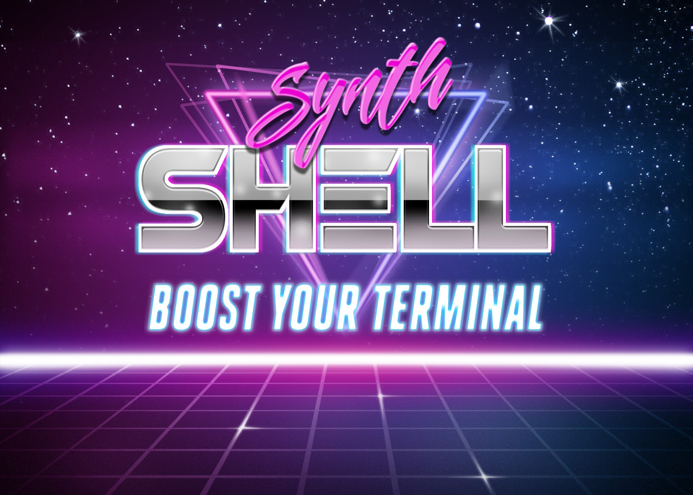
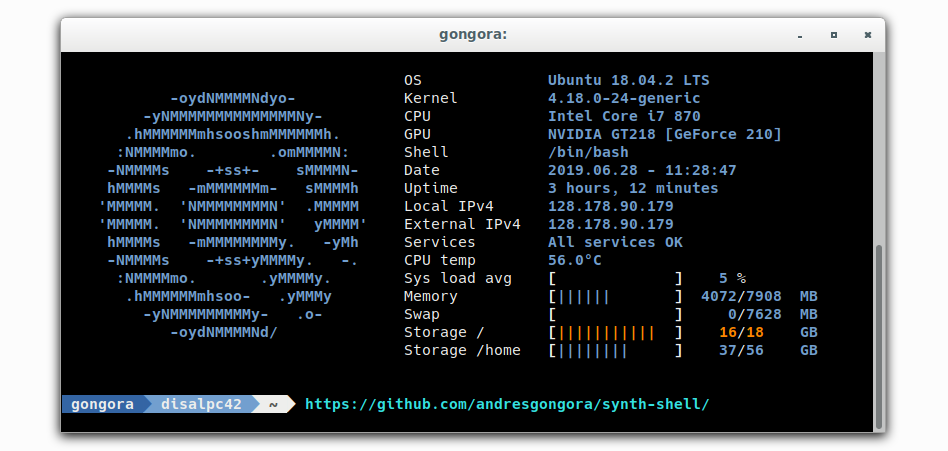

**synth-shell** is a collection of small scripts meant to improve your terminal
and overal productivity - small tweaks can go a long way.
You can find more details and similar tools on
[Yet Another Linux'n Electronics Blog](https://yalneb.blogspot.com/).


- System status report with the most relevant information when you open up a new
  terminal. It also works over SSH to monitor your server or RaspberryPi!!
- Fancy bash prompt with colors. Makes separating your input from 
  command-outputs that much easier. 
- More coming soon...


<br/><br/>


<!--------------------------------------+-------------------------------------->
#                                     Setup
<!--------------------------------------+-------------------------------------->

### Automatic setup

The recommended way to install synth-shell is to run the provided setup script.
This will guide you step by step through the process and let you choose what
to install. It will also allow you to install the script for your user only,
or system-wide (super user privileges required). To proceed, 
[open and play this link in a separate tab](https://www.youtube.com/embed/MpN91wHAr1k)
if you want to feel like
[Hackerman](https://www.youtube.com/embed/KEkrWRHCDQU),
then enter the following into your terminal or telnet session:
```
git clone --recursive https://github.com/andresgongora/synth-shell.git
chmod +x synth-shell/setup.sh
synth-shell/setup.sh
rm -fr synth-shell # optional, to remove the cloned git repo
bash
source ~/.bashrc
```


If you want to use `fancy-bash-promt.sh` you also need power-line fonts.
Depending on your distro you can install them as follows (the exact name of the package varies from distro to distro):

* ArchLinux: `sudo pacman -S powerline-fonts`
* Debian/Ubuntu: `sudo apt install fonts-powerline`


### Script configuration/customization
You can configure your scripts by modifying the corresponding configuration
files. In addition to said files, you can also find configuration examples
in the following folders depending on how you installed **synth-shell**:

* Current user only: `~/.config/synth-shell/`
* System wide: `~/etc/synth-shell/`


### Manual installation of individual scripts
If you want to skip the above steps, and are only interested in a very
specific script, you can easily use it on its own.
However, some scripts might source other scripts from the `bash-tools` folder,
as they provide shared functionalities to all scripts. If you are interested
in a single script from my collection, check whether it depends on a script from
bash-tools, and copy the content of said dependency into the script you want.


### Uninstallation
It's hard to say goodbye, but we had good times together, didn't we? :) 
Just run the script again as if to install it, 
but choose `uninstall` when prompted.


<br/><br/>


<!--------------------------------------+-------------------------------------->
#                                    Overview
<!--------------------------------------+-------------------------------------->




### status.sh
Provides a summarized system report at a single glance every time you open up a
new terminal. If it detects that any system parameter (e.g. cpu load,
memory, etc.) is over a critical threshold, it will provide a warning and 
additional information about the cause. Last but not least, it also prints a
user configurable logo such that you may impress your crush from the library 
with some awesome ASCII art.

Feel free to customize your prompt to match your exact requirements with some
of the many available options. For details please check the appropriate
`~/.config/synth-shell/status.config` or `/etc/synth-shell/status.config`
depending on your installation option.


### fancy-bash-prompt.sh
Adds colors and triangular separators to your bash prompt. 
For best results, consider installing (and telling your terminal to use) 
the `hack-ttf` font alongside the powerline-fonts (the later is required for
the separators).


<br/><br/>


<!--------------------------------------+-------------------------------------->
#                                   Contribute
<!--------------------------------------+-------------------------------------->

This project is only possible thanks to the effort and passion of many, 
including developers, testers, and of course, our beloved coffee vending machine.
You can find a detailed list of everyone involved in the development
in [AUTHORS.md](AUTHORS.md). Thanks to all of you!

If you like this project and want to contribute, you are most welcome to do so.


### Help us improve

* [Report a bug](https://github.com/andresgongora/synth-shell/issues/new/choose): 
  if you notice that something is not right, tell us. We'll try to fix it ASAP.
* Suggest an idea you would like to see in the next release: send us
  and email or open an [issue](https://github.com/andresgongora/synth-shell/issues)!
* Become a developer: fork this repo and become an active developer!
  Take a look at the [issues](https://github.com/andresgongora/synth-shell/issues)
  for suggestions of where to start. Also, take a look at our 
  [coding style](coding_style.md).


### Git branches

There are two branches in this repository:

* **master**: this is the main branch, and thus contains fully functional 
  scripts. When you want to use the scripts as a _user_, 
  this is the branch you want to clone or download.
* **develop**: this branch contains all the new features and most recent 
  contributions. It is always _stable_, in the sense that you can use it
  without major inconveniences. 
  However, it's very prone to undetected bugs and it might be subject to major
  unannounced changes. If you want to contribute, this is the branch 
  you should pull-request to.


<br/><br/>


<!--------------------------------------+-------------------------------------->
#                                     About
<!--------------------------------------+-------------------------------------->

Why **synth-shell**? That's a quite easy question. Its started out as a loose
bunch of (super simple) scripts that I kept around to aid me during
system maintenance. But after a while, as I started to get the hang of bash
and wrote more complex stuff, I wanted my code not only to work
and be purely useful, but also to provide some eye-candy.

Naturally, it didn't start the way you see it today; Many scripts started out as
an ugly attempt to get the behaviour I wanted, by using many snippets from
different third parties. This meant that the code was usually quite ugly and
full of bugs - not because of the third parties, but because of the way I
integrated them. Yet over time, I rewrote all scripts from scratch, removed
the fluff, and also got lots of help from super-friendly and engaged 
[contributors](AUTHORS.md). The result is what you see today.
I admit it, it's nothing fancy, but writing these scripts provided me with
lots of joy.

And about the name? That's quite easy. I spent most of my coding frenzy
listening to [SynthWave](https://en.wikipedia.org/wiki/Synthwave).


<br/><br/>


<!--------------------------------------+-------------------------------------->
#                                    License
<!--------------------------------------+-------------------------------------->

Copyright (c) 2014-2019, Andres Gongora - www.andresgongora.com

* This software is released under a GPLv3 license.
  Read [license-GPLv3.txt](LICENSE),
  or if not present, <http://www.gnu.org/licenses/>.
* If you need a closed-source version of this software
  for commercial purposes, please contact the authors.

